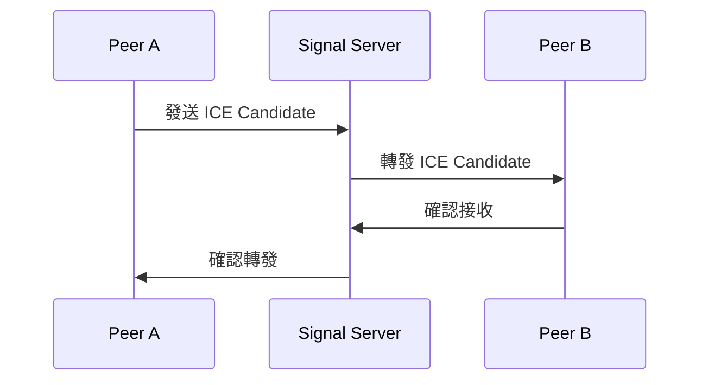
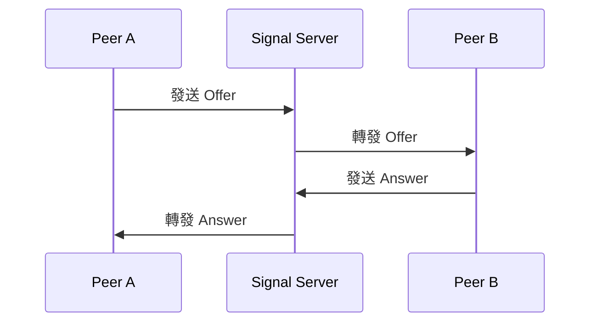

# Collaboration Module 技術文件

## 目錄
1. [模組概述](#模組概述)
2. [系統架構](#系統架構)
3. [核心功能](#核心功能)
4. [API 文件](#api-文件)
5. [WebSocket 事件](#websocket-事件)
6. [資料模型](#資料模型)
7. [整合事件](#整合事件)
8. [部署與配置](#部署與配置)

## 模組概述

Collaboration Module 是一個負責管理即時協作房間的後端模組，主要處理：
- 房間的生命週期管理
- WebRTC 信令中繼
- 玩家狀態同步
- 跨模組事件整合

### 技術堆疊
- NestJS 框架
- WebSocket (Socket.IO)
- TypeORM
- Event Emitter
- PostgreSQL

## 系統架構

### 目錄結構
```
src/modules/collaboration/
├── application/
│   ├── use-cases/
│   │   ├── create-room.use-case.ts
│   │   ├── join-room.use-case.ts
│   │   ├── leave-room.use-case.ts
│   │   ├── update-rules.use-case.ts
│   │   ├── handle-ice-candidate.use-case.ts
│   │   ├── handle-offer.use-case.ts
│   │   ├── handle-answer.use-case.ts
│   │   └── handle-connection-state.use-case.ts
│   └── validators/
│       ├── room-rule.validator.ts
│       └── peer-status.validator.ts
├── domain/
│   ├── services/
│   │   ├── room.service.ts
│   │   └── peer.service.ts
│   ├── interfaces/
│   │   ├── room.repository.interface.ts
│   │   └── peer.repository.interface.ts
│   ├── events/
│   │   ├── connection-events.ts
│   │   └── signaling-events.ts
│   └── value-objects/
│       ├── room-rule.vo.ts
│       ├── connection-state.vo.ts
│       └── signal-state.vo.ts
├── infrastructure/
│   ├── entities/
│   │   ├── RoomEntity.ts
│   │   └── PeerEntity.ts
│   ├── repositories/
│   │   ├── room.repository.ts
│   │   └── peer.repository.ts
│   ├── gateways/
│   │   └── collaboration.gateway.ts
│   └── services/
│       ├── signal.service.ts
│       ├── connection.service.ts
│       ├── reconnection.service.ts
│       ├── message-queue.service.ts
│       ├── load-balancer.service.ts
│       ├── monitoring.service.ts
│       └── websocket.service.ts
├── presentation/
│   ├── controllers/
│   │   └── room.controller.ts
│   └── dtos/
│       ├── create-room.dto.ts
│       ├── join-room.dto.ts
│       └── update-rules.dto.ts
├── __tests__/
│   ├── unit/
│   └── integration/
└── index.ts
```

### 核心元件
1. **Domain Layer**
   - 定義核心業務邏輯
   - 實作領域服務
   - 定義儲存庫介面
   - 定義值物件

2. **Application Layer**
   - 實作使用案例
   - 處理業務規則驗證
   - 協調領域物件

3. **Infrastructure Layer**
   - 實作資料庫實體
   - 實作儲存庫
   - 處理 WebSocket 連接
   - 提供外部服務整合

4. **Presentation Layer**
   - 處理 HTTP 請求
   - 定義 DTO
   - 實作 API 端點

### 實體結構

#### Domain Entity (Room)
```typescript
// src/core/domain/entities/Room.ts
import { AggregateRoot } from '../../../shared/domain/AggregateRoot';
import { RoomRuleVO } from '../value-objects/room-rule.vo';

export type RoomProps = {
    ownerId: string;
    rules: RoomRuleVO;
    players: Set<string>;
    isActive: boolean;
    createdAt: Date;
    updatedAt: Date;
};

export class Room extends AggregateRoot<string> {
    private readonly _ownerId: string;
    private readonly _rules: RoomRuleVO;
    private readonly _players: Set<string>;
    private readonly _isActive: boolean;
    private readonly _createdAt: Date;
    private readonly _updatedAt: Date;

    private constructor(id: string, props: RoomProps) {
        super(id);
        this._ownerId = props.ownerId;
        this._rules = props.rules;
        this._players = props.players;
        this._isActive = props.isActive;
        this._createdAt = props.createdAt;
        this._updatedAt = props.updatedAt;
    }

    public static create(id: string, props: RoomProps): Room {
        return new Room(id, props);
    }

    // Getters and business methods
}
```

#### Infrastructure Entity (RoomEntity)
```typescript
// src/modules/collaboration/infrastructure/entities/RoomEntity.ts
import { Entity, PrimaryColumn, Column, CreateDateColumn, UpdateDateColumn } from 'typeorm';

@Entity('rooms')
export class RoomEntity {
    @PrimaryColumn('uuid')
    id: string;

    @Column()
    ownerId: string;

    @Column('jsonb')
    rules: {
        maxPlayers: number;
        allowRelay: boolean;
        latencyTargetMs: number;
        opusBitrate: number;
    };

    @Column('simple-array')
    players: string[];

    @Column({ default: true })
    isActive: boolean;

    @CreateDateColumn()
    createdAt: Date;

    @UpdateDateColumn()
    updatedAt: Date;
}
```

## 核心功能

### 1. 房間管理
- 建立房間
- 更新房間規則
- 關閉房間
- 查詢房間狀態

### 2. 玩家管理
- 加入房間
- 離開房間
- 玩家狀態同步
- 房規校驗

### 3. WebRTC 信令
- ICE Candidate 交換
- Offer/Answer 協商
- 連線狀態監控
- 降級機制

## API 文件

### REST API

#### 建立房間
```http
POST /rooms
Content-Type: application/json

{
  "ownerId": "string",
  "rules": {
    "maxPlayers": number,
    "allowRelay": boolean,
    "latencyTargetMs": number,
    "opusBitrate": number
  }
}
```

#### 更新房間規則
```http
PATCH /rooms/:id/rules
Content-Type: application/json

{
  "rules": {
    "maxPlayers": number,
    "allowRelay": boolean,
    "latencyTargetMs": number,
    "opusBitrate": number
  }
}
```

#### 關閉房間
```http
DELETE /rooms/:id
```

### WebSocket API

#### 連接
```typescript
// 連接參數
{
  roomId: string;
  peerId: string;
}
```

#### 事件
1. **ice-candidate**
```typescript
{
  from: string;      // 發送者 ID
  candidate: object; // ICE candidate
}
```

2. **offer**
```typescript
{
  from: string;  // 發送者 ID
  offer: object; // WebRTC offer
}
```

3. **answer**
```typescript
{
  from: string;   // 發送者 ID
  answer: object; // WebRTC answer
}
```

## 資料模型

### Room Entity
```typescript
interface Room {
  id: string;
  ownerId: string;
  rules: RoomRuleVO;
  players: Set<Peer>;
  isActive: boolean;
  createdAt: Date;
  updatedAt: Date;
}
```

### Peer Entity
```typescript
interface Peer {
  id: string;
  joinedAt: Date;
  iceState: string;
  relayState: string;
}
```

### RoomRuleVO
```typescript
interface RoomRuleVO {
  maxPlayers: number;
  allowRelay: boolean;
  latencyTargetMs: number;
  opusBitrate: number;
}
```

## 整合事件

### 發佈事件
1. **collab.room-created**
```typescript
{
  roomId: string;
  ownerId: string;
  rules: RoomRuleVO;
}
```

2. **collab.player-joined**
```typescript
{
  roomId: string;
  peerId: string;
}
```

3. **collab.player-left**
```typescript
{
  roomId: string;
  peerId: string;
}
```

4. **collab.room-rule-changed**
```typescript
{
  roomId: string;
  rules: RoomRuleVO;
}
```

5. **collab.room-closed**
```typescript
{
  roomId: string;
}
```

## 部署與配置

### 環境變數
```env
# WebSocket 配置
WS_PORT=3001
WS_PATH=/ws

# 資料庫配置
DB_HOST=localhost
DB_PORT=5432
DB_NAME=collaboration
DB_USER=postgres
DB_PASSWORD=secret

# 其他配置
MAX_ROOMS=1000
MAX_PLAYERS_PER_ROOM=10
```

### Docker 配置
```yaml
version: '3.8'
services:
  collaboration:
    build: .
    ports:
      - "3001:3001"
    environment:
      - NODE_ENV=production
      - WS_PORT=3001
      - DB_HOST=postgres
      - DB_PORT=5432
      - DB_NAME=collaboration
      - DB_USER=postgres
      - DB_PASSWORD=secret
    depends_on:
      - postgres

  postgres:
    image: postgres:14
    environment:
      - POSTGRES_DB=collaboration
      - POSTGRES_USER=postgres
      - POSTGRES_PASSWORD=secret
    volumes:
      - postgres_data:/var/lib/postgresql/data

volumes:
  postgres_data:
```

### 效能考量
1. **水平擴展**
   - 使用 Redis 作為 WebSocket 訊息代理
   - 實作房間分片策略
   - 負載均衡配置

2. **監控指標**
   - 房間數量
   - 玩家數量
   - WebSocket 連接數
   - 信令延遲
   - 系統資源使用率

3. **降級策略**
   - TURN 伺服器配置
   - WebSocket 中繼模式
   - 自動重連機制 

## Signal Server 規劃

### 1. 信令服務架構

#### 1.1 核心服務
```typescript
// signal.service.ts
@Injectable()
export class SignalService {
  // 處理 ICE Candidate
  async handleIceCandidate(data: {
    roomId: string;
    from: string;
    to: string;
    candidate: RTCIceCandidate;
  }): Promise<void>;

  // 處理 Offer
  async handleOffer(data: {
    roomId: string;
    from: string;
    to: string;
    offer: RTCSessionDescription;
  }): Promise<void>;

  // 處理 Answer
  async handleAnswer(data: {
    roomId: string;
    from: string;
    to: string;
    answer: RTCSessionDescription;
  }): Promise<void>;
}

// connection.service.ts
@Injectable()
export class ConnectionService {
  // 追蹤連線狀態
  private readonly connections: Map<string, ConnectionState>;

  // 更新連線狀態
  async updateConnectionState(
    peerId: string,
    state: ConnectionState
  ): Promise<void>;

  // 獲取連線狀態
  getConnectionState(peerId: string): ConnectionState;
}

// reconnection.service.ts
@Injectable()
export class ReconnectionService {
  // 處理重連
  async handleReconnection(
    peerId: string,
    roomId: string
  ): Promise<boolean>;

  // 重設重連計數
  resetReconnectionAttempts(peerId: string): void;
}
```

#### 1.2 效能優化服務
```typescript
// message-queue.service.ts
@Injectable()
export class MessageQueueService {
  // 訊息佇列
  private readonly queue: Map<string, SignalMessage[]>;

  // 加入訊息到佇列
  enqueue(roomId: string, message: SignalMessage): void;

  // 處理佇列訊息
  async processQueue(roomId: string): Promise<void>;
}

// load-balancer.service.ts
@Injectable()
export class LoadBalancerService {
  // 伺服器負載追蹤
  private readonly serverLoads: Map<string, number>;

  // 選擇最佳伺服器
  selectServer(roomId: string): string;

  // 更新伺服器負載
  updateServerLoad(serverId: string, load: number): void;
}
```

#### 1.3 監控服務
```typescript
// monitoring.service.ts
@Injectable()
export class MonitoringService {
  // 監控指標
  private readonly metrics: {
    activeConnections: number;
    roomCount: number;
    messageRate: number;
    averageLatency: number;
  };

  // 收集指標
  @Interval(5000)
  async collectMetrics(): Promise<void>;

  // 發送指標
  async sendMetrics(metrics: Metrics): Promise<void>;
}
```

### 2. 信令流程

#### 2.1 ICE Candidate 交換


#### 2.2 Offer/Answer 協商


### 3. 效能考量

#### 3.1 訊息佇列
- 使用 Redis 作為訊息佇列
- 實作訊息優先級
- 處理訊息重試機制
- 訊息過期清理

#### 3.2 負載均衡
- 基於房間 ID 的雜湊分片
- 動態負載調整
- 伺服器健康檢查
- 自動故障轉移

#### 3.3 連線池管理
- 連線池大小限制
- 連線超時處理
- 資源釋放機制
- 連線狀態追蹤

### 4. 監控與日誌

#### 4.1 監控指標
```typescript
interface Metrics {
  // 連線相關
  activeConnections: number;
  connectionRate: number;
  disconnectionRate: number;
  
  // 房間相關
  roomCount: number;
  averageRoomSize: number;
  
  // 信令相關
  messageRate: number;
  averageLatency: number;
  errorRate: number;
  
  // 系統相關
  cpuUsage: number;
  memoryUsage: number;
  networkUsage: number;
}
```

#### 4.2 日誌級別
```typescript
enum LogLevel {
  ERROR = 'error',    // 錯誤日誌
  WARN = 'warn',      // 警告日誌
  INFO = 'info',      // 一般資訊
  DEBUG = 'debug',    // 除錯資訊
  TRACE = 'trace'     // 追蹤資訊
}
```

#### 4.3 錯誤處理
```typescript
interface ErrorHandler {
  // 處理信令錯誤
  handleSignalingError(error: Error): void;
  
  // 處理連線錯誤
  handleConnectionError(error: Error): void;
  
  // 處理系統錯誤
  handleSystemError(error: Error): void;
  
  // 錯誤恢復機制
  recoverFromError(error: Error): Promise<void>;
}
```

### 5. 環境配置

#### 5.1 Signal Server 配置
```env
# Signal Server 配置
SIGNAL_SERVER_PORT=3001
SIGNAL_SERVER_PATH=/ws
MAX_CONNECTIONS=10000
CONNECTION_TIMEOUT=30000
MESSAGE_QUEUE_SIZE=1000

# Redis 配置
REDIS_HOST=localhost
REDIS_PORT=6379
REDIS_PASSWORD=secret

# 監控配置
METRICS_INTERVAL=5000
LOG_LEVEL=info
```

#### 5.2 效能配置
```env
# 效能配置
MAX_ROOMS_PER_SERVER=1000
MAX_PEERS_PER_ROOM=10
MESSAGE_QUEUE_BATCH_SIZE=100
CONNECTION_POOL_SIZE=1000
```

## 使用指南

### 1. 安裝與配置

#### 1.1 安裝依賴
```bash
# 安裝必要套件
npm install @nestjs/websockets @nestjs/platform-socket.io socket.io
npm install @nestjs/event-emitter
npm install typeorm @nestjs/typeorm pg
```

#### 1.2 環境配置
```env
# .env
# 資料庫配置
DB_HOST=localhost
DB_PORT=5432
DB_NAME=collaboration
DB_USER=postgres
DB_PASSWORD=secret

# WebSocket 配置
WS_PORT=3001
WS_PATH=/ws

# Redis 配置（用於訊息佇列）
REDIS_HOST=localhost
REDIS_PORT=6379
REDIS_PASSWORD=secret
```

### 2. 模組整合

#### 2.1 在 AppModule 中引入
```typescript
// src/app.module.ts
import { Module } from '@nestjs/common';
import { CollaborationModule } from './modules/collaboration';

@Module({
  imports: [
    CollaborationModule,
    // ... 其他模組
  ],
})
export class AppModule {}
```

#### 2.2 配置 TypeORM
```typescript
// src/config/typeorm.config.ts
import { TypeOrmModuleOptions } from '@nestjs/typeorm';
import { RoomEntity } from '../modules/collaboration/infrastructure/entities/RoomEntity';
import { PeerEntity } from '../modules/collaboration/infrastructure/entities/PeerEntity';

export const typeOrmConfig: TypeOrmModuleOptions = {
  type: 'postgres',
  host: process.env.DB_HOST,
  port: parseInt(process.env.DB_PORT, 10),
  username: process.env.DB_USER,
  password: process.env.DB_PASSWORD,
  database: process.env.DB_NAME,
  entities: [RoomEntity, PeerEntity],
  synchronize: process.env.NODE_ENV !== 'production',
};
```

### 3. 前端整合

#### 3.1 建立 WebSocket 連接
```typescript
// 前端程式碼
import { io } from 'socket.io-client';

const socket = io('http://localhost:3001/ws', {
  query: {
    roomId: 'room-123',
    peerId: 'peer-456'
  }
});

// 監聽事件
socket.on('connect', () => {
  console.log('Connected to Signal Server');
});

socket.on('ice-candidate', (data) => {
  // 處理 ICE Candidate
  const { from, candidate } = data;
  // ... 處理邏輯
});

socket.on('offer', (data) => {
  // 處理 Offer
  const { from, offer } = data;
  // ... 處理邏輯
});

socket.on('answer', (data) => {
  // 處理 Answer
  const { from, answer } = data;
  // ... 處理邏輯
});
```

#### 3.2 發送信令
```typescript
// 發送 ICE Candidate
socket.emit('ice-candidate', {
  roomId: 'room-123',
  from: 'peer-456',
  to: 'peer-789',
  candidate: iceCandidate
});

// 發送 Offer
socket.emit('offer', {
  roomId: 'room-123',
  from: 'peer-456',
  to: 'peer-789',
  offer: offer
});

// 發送 Answer
socket.emit('answer', {
  roomId: 'room-123',
  from: 'peer-456',
  to: 'peer-789',
  answer: answer
});
```

### 4. API 使用範例

#### 4.1 建立房間
```typescript
// 使用 REST API
const response = await fetch('http://localhost:3000/rooms', {
  method: 'POST',
  headers: {
    'Content-Type': 'application/json',
  },
  body: JSON.stringify({
    ownerId: 'user-123',
    rules: {
      maxPlayers: 4,
      allowRelay: true,
      latencyTargetMs: 100,
      opusBitrate: 64000
    }
  })
});

const room = await response.json();
```

#### 4.2 加入房間
```typescript
// 使用 WebSocket
socket.emit('join', {
  roomId: 'room-123',
  peerId: 'peer-456'
});
```

#### 4.3 更新房間規則
```typescript
// 使用 REST API
const response = await fetch('http://localhost:3000/rooms/room-123/rules', {
  method: 'PATCH',
  headers: {
    'Content-Type': 'application/json',
  },
  body: JSON.stringify({
    rules: {
      maxPlayers: 6,
      allowRelay: true,
      latencyTargetMs: 150,
      opusBitrate: 96000
    }
  })
});
```

### 5. 錯誤處理

#### 5.1 重連機制
```typescript
// 前端程式碼
socket.on('disconnect', () => {
  console.log('Disconnected from Signal Server');
  // 實作重連邏輯
  setTimeout(() => {
    socket.connect();
  }, 1000);
});

socket.on('connect_error', (error) => {
  console.error('Connection error:', error);
  // 處理連線錯誤
});
```

#### 5.2 錯誤處理
```typescript
// 前端程式碼
socket.on('error', (error) => {
  console.error('Socket error:', error);
  // 處理錯誤
});

// 後端錯誤處理
@Catch()
export class CollaborationExceptionFilter implements ExceptionFilter {
  catch(exception: unknown, host: ArgumentsHost) {
    const ctx = host.switchToHttp();
    const response = ctx.getResponse<Response>();
    
    // 處理錯誤並回傳適當的錯誤訊息
    response.status(500).json({
      statusCode: 500,
      message: 'Internal server error',
      error: exception.message
    });
  }
}
```

### 6. 監控與除錯

#### 6.1 啟用日誌
```typescript
// 在 main.ts 中配置
import { Logger } from '@nestjs/common';

async function bootstrap() {
  const app = await NestFactory.create(AppModule);
  app.useLogger(new Logger());
  await app.listen(3000);
}
```

#### 6.2 監控指標
```typescript
// 使用 Prometheus 監控
import { PrometheusController } from './modules/collaboration/infrastructure/controllers/prometheus.controller';

@Module({
  controllers: [PrometheusController],
})
export class CollaborationModule {}
```

### 7. 最佳實踐

1. **錯誤處理**
   - 實作完整的錯誤處理機制
   - 使用適當的錯誤碼和訊息
   - 記錄錯誤日誌

2. **效能優化**
   - 使用訊息佇列處理大量訊息
   - 實作連線池管理
   - 監控系統資源使用

3. **安全性**
   - 實作適當的認證機制
   - 驗證所有輸入
   - 限制連線數量

4. **可擴展性**
   - 使用負載均衡
   - 實作水平擴展
   - 監控系統效能

// ... rest of the existing content ... 